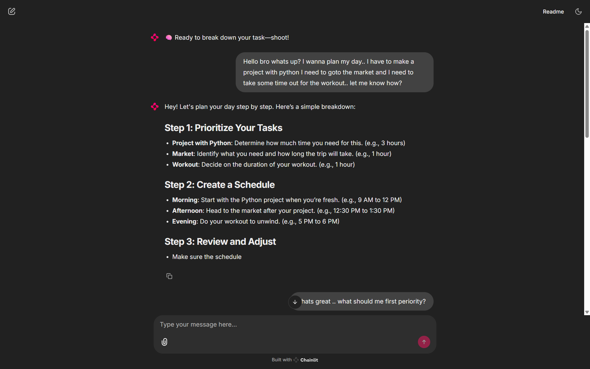
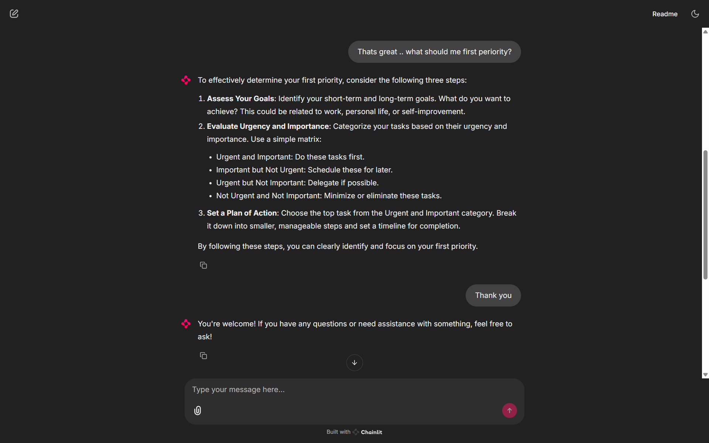

# 🧠 SmartTask Agent

SmartTask Agent is a lightweight AI assistant powered by OpenAI's GPT‑4o‑mini. It helps you break down any task or goal into **3 clear, actionable steps** — perfect for productivity, planning, and personal growth.

Built using the **OpenAI API + Chainlit**, this project showcases how simple, focused agents can deliver value through conversational interfaces.

---

## 💡 What It Does

Just tell SmartTask Agent what you're trying to do — and it will give you a 3-step breakdown.

**Example:**  
*“I want to start freelancing.”*

**Response:**
1. Identify your freelancing niche (e.g., writing, design).  
2. Create profiles on platforms like Upwork or Fiverr.  
3. Start applying to small projects to build credibility.

---

## ⚙️ Tech Stack

- 🧠 OpenAI GPT‑4o‑mini  
- ⚡ Chainlit (chat UI)  
- 🌐 Python 3.10+  
- 🔐 .env-based secure API key

---

## 🚀 How to Run

### 1. Clone this repo

```bash
git clone https://github.com/yourusername/smarttask_agent.git
cd smarttask_agent
```

### 2. Create `.env` file

```env
OPENAI_API_KEY=sk-xxxxxxxxxxxxxxxxxxxxxxxxxxxxxxxxxxxxxxxx
```

> 🔒 Never share this key publicly. It’s already ignored in `.gitignore`.

### 3. Install dependencies

```bash
pip install chainlit openai
```

### 4. Start the app

```bash
chainlit run chainlit_app.py -w
```

Then open your browser at 👉 http://localhost:8000

---

## 📂 Project Structure

```
smarttask_agent/
│
├── agent.py             # GPT-based task breakdown logic
├── chainlit_app.py      # Chainlit UI interface
├── .env                 # Your OpenAI API key (not committed)
├── .gitignore           # Ignores .env and other sensitive files
└── README.md            # This file
```

---

## 📸 Screenshots

Here’s what SmartTask Agent looks like in action:

| Task Prompt 💬 | Response 📋 |
|----------------|-------------|
|  |  |

> Place your images inside the `public/` folder with matching names.

---

## 🔗 Live Demo

_Coming soon (e.g., Render, Railway, Hugging Face)_

---

## 👨‍💻 Author

**Zohaib Javed**  
📧 Email: [zohaibjaved@gmail.com](mailto:zohaibjaved@gmail.com)  
🔗 LinkedIn: [https://www.linkedin.com/in/zohaib-javd](https://www.linkedin.com/in/zohaib-javd)  
❎ X: [https://x.com/zohaibjaved](https://x.com/zohaibjaved)

---

## 📢 Disclaimer

This app uses your **OpenAI API key**. Any use of the assistant may incur charges on your account. Always use secure deployment practices.

---

## 📌 Future Ideas

- Add memory to track completed tasks
- Deploy online with usage controls
- Turn this into a multi-agent productivity system

---

**Built with love, curiosity, and code.** 🔥
